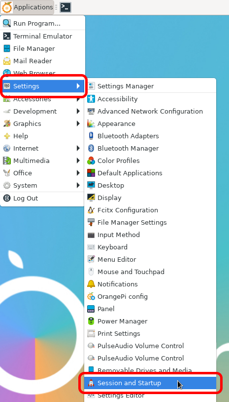

# daily-display

This README is a work in progress.

## Overview

Designed to be displayed on a wall-mounted screen, Daily Display combines a calendar of tasks 
for each day with a pill dispenser and reciept printer to help guide someone living with
Alzheimer's disease or dementia through their day.

Daily Display is designed to be entirely software-controlled, and all configuration can be
done remotely using a computer or smartphone.
This also allows a caretaker to check in on medication status for the patient, update their
calendar, and send messages throughout the day.

In my implementation, I mounted an old computer monitor as well as my pill dispenser mechanism
on a kitchen wall to improve conspicuousness.

## Parts List

### Electronics

- Orange Pi Zero 3 single board computer, under $35 on [Amazon](https://www.amazon.com/dp/B0CB12XS91)
  - I selected this SBC during the Raspberry Pi shortage, and it has satisfied my needs well;
  however, there are many alternatives you could try with only minor software modifications.
  - I went for the model with 1GB of RAM, but the 1.5GB is not significantly more expensive.
  Pretty much anything goes, though, and it just has to run two web servers and Chromium as a kiosk.
- PCA9685 PWM servo driver board, about $10 on [Amazon](https://www.amazon.com/s?k=pca9685)
- One servo motor (i.e. Tower Pro SG90) for each pill you'd like to dispense
  - Consider metal gears, because a jammed pill (or foreign object debris) may strip plastic gears
  - The CAD files I included are designed for four different medications, meaning four servos
- Serial thermal printer, about $50 on [Amazon](https://www.amazon.com/s?k=ttl+thermal+printer)
- TCRT5000 IR reflectance sensor, under $10 on [Amazon](https://www.amazon.com/s?k=tcrt5000)
  - Used to determine if pills have actually been dispensed, and if a hand has grabbed them from the output trays
- Computer monitor
  - I used an old 1440x900 monitor with a micro-HDMI to VGA adapter.
  - You'll pretty much always need some adapter because the Orange Pi uses micro-HDMI, but if you *had to* buy one new, I'd go for one of those 15.6" portable monitors since it would be flush with the wall (or could stand on a surface)
  - I ended up using a low profile VESA mount and some wall anchors to hang mine. It's ugly but functional.

### 3D Printed Parts

Editable source files are included in the `cad/Fusion` and `cad/STEP` directories to support the majority of CAD packages.
As the names imply, I have deleted and redacted some components of the CAD files to avoid sharing
the specific medications that I designed my system for.

You'll need to at least open these CAD files and make a few changes to match the dimensions of your
specific pills.
Included in those files is an example mechanism for a round and oval pill.
Some trial and error is necessary here, and my ziploc bag of scrapped prototype parts is overflowing.

In the `cad/3MF` directory there are ready-to-print files for the following parts:
- Thermal printer enclosure
- Pill dispenser mechanism base (holds the servo motor and customized parts)
- Sensor cover (protects the TCRT5000s from dust, bumps, and light to some degree)

If you happen to be using four pills as I am, then the following parts of the case will also work for you:
- Lower Plate
- Upper Plate
- Walls

## Source code

The backend relies on Flask, which serves JSON to a Vue frontend using Axios to make requests.

The calendar can be connected to any iCalendar-compatible service, including Google Calendar.
As of right now, the calendar integration can be customized by customizing the auto-generated
`config.ini` file in the `backend` directory with the following contents:

```
# backend/config.ini
...
calendar_url=yoururlhere
...
```

In Google Calendar, this URL can be found by hovering over the calendar name in the left navbar,
clicking the menu icon, then clicking *Settings and Sharing*, and scrolling down to the *Integrate calendar*
heading. You can then click the clipboard icon in the *Secret address in iCal format* box, and paste that URL
into the `config.ini` file.

## Installation

**Warning:** these steps are incomplete and subject to change. Proceed only with experience!

### Prerequisites

#### node via nvm

As explained in full detail at [https://github.com/nvm-sh/nvm](https://github.com/nvm-sh/nvm), run the following commands to install node using nvm.
1. Run `curl -o- https://raw.githubusercontent.com/nvm-sh/nvm/v0.39.5/install.sh | bash` to download and install nvm
2. Close and reopen your terminal
3. Ensure that `command -v nvm` returns `nvm`
4. Install the latest version of node using `nvm install node`

### Set up
1. Install all node modules required for the frontend:
```
cd whiteboard-recorder/frontend
npm install
```
2. Install the Python packages for the backend
```
cd ../backend
python3 -m venv venv
source venv/bin/activate
pip3 install -r requirements.txt
```

#### To run Daily Display on boot:
1. Copy `daily-display-backend.service` and `daily-display-frontend.service` into the `/etc/systemd/system` directory:
```bash
cd daily-display
cp daily-display-backend.service /etc/systemd/system/.
cp daily-display-frontend.service /etc/systemd/system/.
```
2. Reload the systemctl daemon:
```bash
sudo systemctl daemon-reload
```
3. Enable both services to run at boot:
```bash
sudo systemctl enable daily-display-backend.service
sudo systemctl enable daily-display-frontend.service
```
**This only enables the Daily Display software and web interface server.** To also automatically open
a fullscreen browser window, follow the below instructions.

#### To automatically start Chromium in kiosk mode:
1. Identify your operating system's application autostart feature. This tutorial will show the process for an Orange Pi Zero 3 running Debian 12 "bookworm" with the Xfce desktop environment.


2. Launch the Application Autostart manager. For me, it was located under `Settings -> Session and Startup` on the **Application Autostart** tab.


3. Create a new entry by clicking the <kbd>+ Add</kbd> button, then fill in name and description however you like.
4. Fill the command input box with the following command:
```bash
chromium http://localhost:5173 --kiosk
```


5. Finally, click <kbd>OK</kbd> and restart the computer, ensuring that Chromium launches in fullscreen to the correct address after the computer boots up.